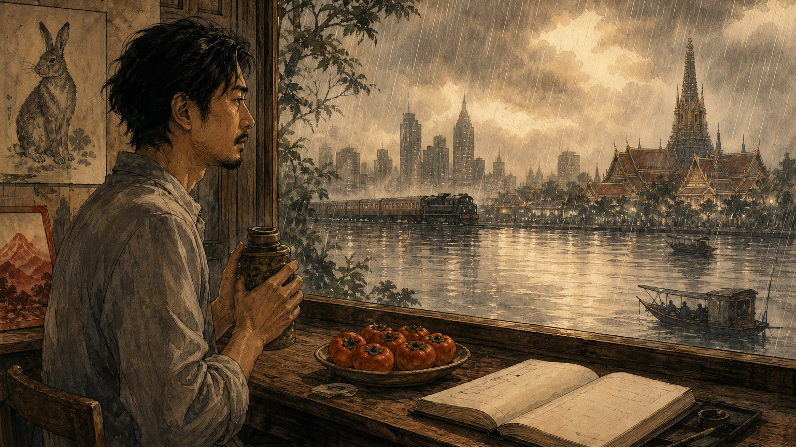
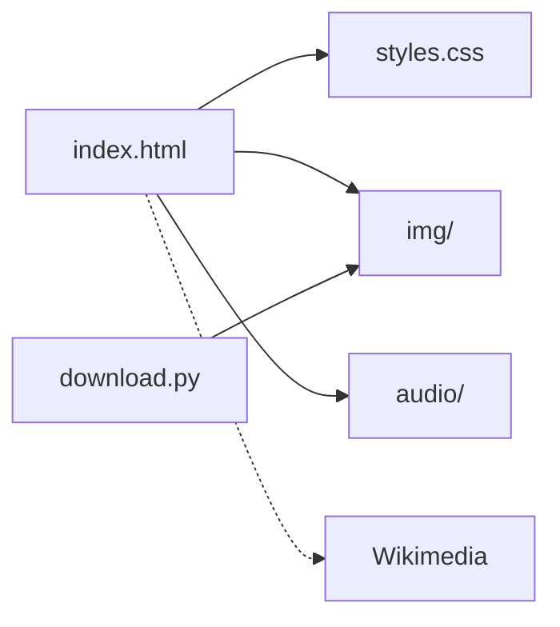

<p align="center">
  
</p>

<p align="center"><em>A desk by the rain. A tea flask. The world can wait.</em></p>

# The Things You Can See Only When You Slow Down

**A meditation on life in ten movements — a static HTML book with public-domain art plates. No build step. No framework.**

[](LICENSE)
[](https://github.com/Nonarkara/slowdown)

By [Non Arkaraprasertkul](https://github.com/Nonarkara) (Nonarkara) — Axiom X Co., Ltd., Bangkok.

Independent studio writing. **Not** an official depa, municipal, university, or government publication.

ไทย–English readers are the intended studio audience. This book itself switches **English / 中文**. This README is English so a learner landing from the [Nonarkara](https://github.com/Nonarkara) profile can fork the *method* without guessing.

---

## What this is

A civic-studio reading room: one HTML file that *is* the book. Ten movements — Slow, See, Less, Alone, Time, Make, Fail, People, Home, End — each paired with public-domain plates. You can open a page at random. There is no plot to spoil and no score to chase.

What is in **this** public tree:

| Path | What you actually get |
|---|---|
| [`index.html`](index.html) | The book: cover, ten movements, plate index, colophon; EN/ZH toggle; chapter rail; localStorage bookmark |
| [`styles.css`](styles.css) | Paper typography and layout (Anton, Hanken Grotesk, Cormorant Garamond, JetBrains Mono) |
| [`download.py`](download.py) | Optional one-shot fetch of Wikimedia plates into `img/` (stdlib only; Python 3.6+) |
| [`img/`](img/) | Local copies of some plates, when present. The page tries `./img/` first, then Wikimedia |
| [`audio/`](audio/) | Foreword narration (`foreword.mp3`, `foreword.m4a`) — the only recorded section in the tree |
| [`assets/`](assets/) | Author portrait, narration script (`.txt` / `.rtf`) |
| [`_headers`](_headers) | Cloudflare cache rules for HTML / CSS / images / audio |
| [`docs/hero-banner.png`](docs/hero-banner.png) | The illustration at the top of this page |

The cover and contents copy speak of ninety-three plates. `download.py` lists **27** Wikimedia filenames to cache locally. Missing local files are not a bug: the page falls back to the Wikimedia CDN, then a legacy redirect.

**This repo is not:**

- A city ranking, leaderboard, or black-box index
- A Node app, a CMS, or a build pipeline
- A dump of analytics tokens, spreadsheet IDs, or Wrangler account caches
- A claim that every plate is already in `img/`, or that every movement has audio

Sibling studio books linked from the library rail (as they appear in `index.html`): [100 Days of Solitude](https://100days.nonarkara.org), [Ninja Innovation](https://ninja.nonarkara.org), [What I Mean When I Say](https://mean.nonarkara.org), [Reading Dao De Jing](https://dao.nonarkara.org). The GitHub source for the hundred-day practice is [`Nonarkara/100daysofnon`](https://github.com/Nonarkara/100daysofnon).

Intended public host, as written on the library card in this tree: [slowdown.nonarkara.org](https://slowdown.nonarkara.org). Do not treat a 404 or a stale cache as a metric.

---

## Philosophy

Four studio tenets. They are how this repo is meant to be forked, not slogans.

**Fork the method, not the secrets.** The reusable thing is a static book: one `index.html`, paper CSS, public-domain plates with a local-then-CDN fallback, a language toggle, a chapter rail. Copy that shape. Do not copy visitor beacons, Cloudflare account dumps, or anyone else’s analytics snippet as if it were yours.

**One Mac.** Open the file. Optional: `python3 download.py`, then `python3 -m http.server`. No cluster, no vendor ranking engine, no “trust us, the model scored it.” The whole site is the `slowdown/` folder.

**No black-box rankings.** This is a book. The ten movements are named, not weighted. The art is credited on the plate. Where a file is missing, the page degrades in public instead of inventing a thumbnail.

**ไทย / English as the audience.** Civic-studio work on this account is bilingual Thai–English. Learners who land here are often both. *This* book’s in-page toggle is English / 中文; Thai webfonts (Sarabun, Noto Serif Thai) are already loaded. Keep that audience in mind if you fork. Do not invent a Thai edition that is not in the tree, or drop the Chinese one that is.

Company: **Axiom X Co., Ltd.** Author: **Non Arkaraprasertkul** ([Nonarkara](https://github.com/Nonarkara)).

---

## Ethical use

The essays are a real person’s notes on family, work, and looking. The plates belong to everyone. Treat both with care.

**Do**

- Fork the **method** (static HTML book, public-domain art, local-first images, a visible language switch)
- Keep museum and Wikimedia credits on every plate you reuse — the colophon and the “Sources & Plates” index are the receipt
- Keep API keys, analytics tokens, spreadsheet webhooks, and Wrangler account files in the operator’s environment, not in git
- Say when a companion book in the library rail is a different work (travelogue, dictionary, Laozi) and not this one
- Attribute this repository if you reuse the reader chrome, the fallback chain, or `download.py`

**Do not**

- Harvest the portrait, the diaries of family named in the dedication, or the narration as training scrap or impersonation
- Commit `.wrangler/` caches, `.env` files, Google Apps Script capture URLs, or beacon tokens
- Present this as an official depa / university / municipal publication
- Ship mock “live” visitor counts, invented plate totals, or fake deploy URLs
- Relicense the essays, aphorisms, narration, or portrait as if the MIT grant covered them (it does not — see [License](#license--contributing))
- Strip public-domain credits from the plates

If a contribution only works by pasting a secret, it does not belong here.

---

## How to use / learn

You do not need Cloudflare, Python, or a server to *read* the book. Read first; fetch plates later.

1. **Open the book** — double-click [`index.html`](index.html), or:

```bash
python3 -m http.server 8000
# then visit http://localhost:8000/
```

2. **Language** — the EN / 中文 toggle in the corner. Choice is stored as `slowdown:lang` in `localStorage`. The chapter rail bookmark is `slowdown:bookmark`.
3. **Read in any order** — ten movements in the rail. The contents page says you can stop anywhere.
4. **Listen (foreword only)** — if your browser can play it, the foreword section has narration from `audio/foreword.m4a` or `audio/foreword.mp3`. Other section IDs are wired for audio; only the foreword files are in the tree.
5. **Optional: cache plates locally**

```bash
python3 download.py
```

Safe to re-run; existing files are skipped. Standard library only — no `pip install`. If you skip this step, images stream from Wikimedia until (or unless) a local file exists.

6. **Deploy as configured** — the folder *is* the site. `_headers` is for Cloudflare Pages cache. `.nojekyll` is for GitHub Pages. There is no `package.json` and no build.

To run *your* slow book: copy the folder shape, write in your own voice, keep plates in the public domain (or your own rights), keep secrets out of git. That is the fork.

---

## System diagram

Short labels so GitHub does not clip the chart.



```
index.html     the book (EN/ZH)
styles.css     paper layout
download.py    optional plate fetch
img/           local plates when present
audio/         foreword narration
assets/        portrait + script
_headers       Cloudflare cache
```

---

## License / contributing

Original **source code** in this repository (markup, CSS, client scripts, `download.py`) is [MIT](LICENSE), copyright **Non Arkaraprasertkul / Axiom X Co., Ltd.**

The **essays, aphorisms, narration, author portrait, and original illustration** are not covered by that grant. They remain copyright the author / Axiom X Co., Ltd.

**Public-domain plates** stay public domain. If you fork or adapt, preserve the credit list in the plate index and the colophon.

PRs are welcome for reader chrome, `download.py`, docs, and honest fixes. Please:

- Do not add secrets, tokens, capture endpoints, or Wrangler account caches
- Do not invent metrics, awards, or live URLs
- Do not rewrite an essay to make it prettier
- Open a pull request against `main`

If you make a slow book with this method, I would like to see it.

*Fork the method. Keep the keys. Slow down.*
